# fishdraw

*procedurally generated fish drawings*

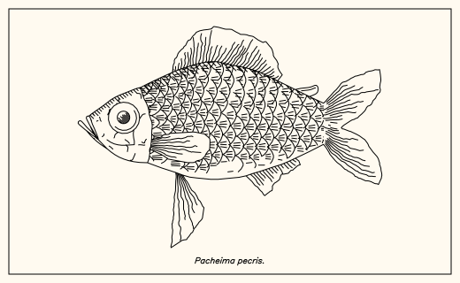

- generates all sorts of weird fishes
- outputs polylines (supported format svg, json, csv, etc.)
- full procedural generation, single file no dependencies
- plotter-centric
- export drawing animation:


## usage

basic

```
node fishdraw.js > output.svg
```

specify seed (from a string) and output format:

```
node fishdraw.js --seed "Biggus fishus" --format smil > output.svg
```

- the seed string is used as the name of the fish (printed in the drawing). If unspecified, a random pseudo-Latin name will be auto generated.
- format options: `svg` (regular svg), `smil` (animated svg), `csv` (each polyline on a comma-separated line) and `json`.

use as JS library:

```js
const {fish,generate_params} = require('./fishdraw.js');
let polylines = fish(generate_params());
console.log(polylines);
```


## gallery

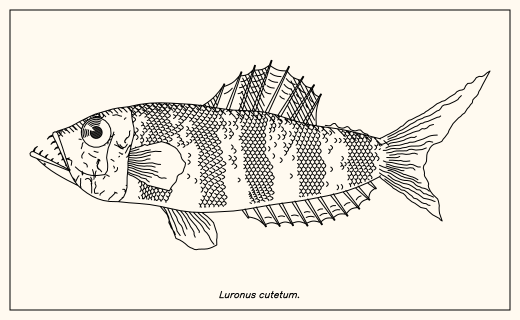
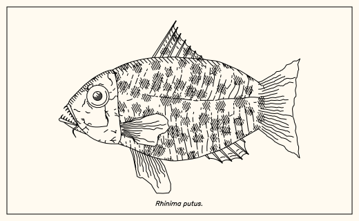
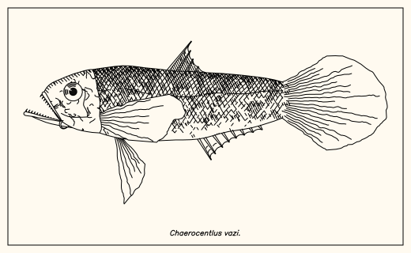
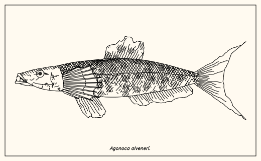
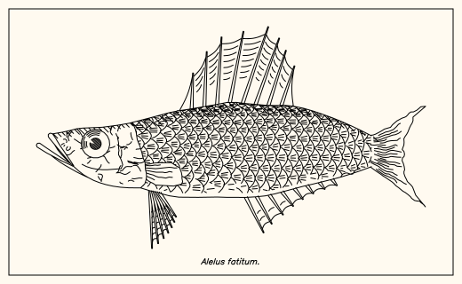
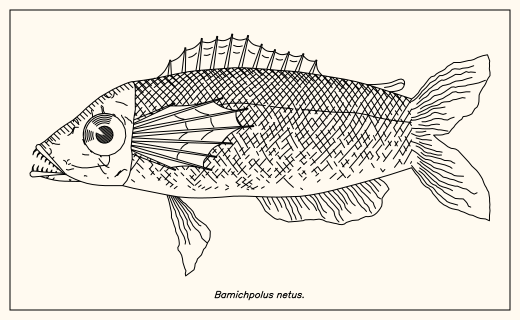
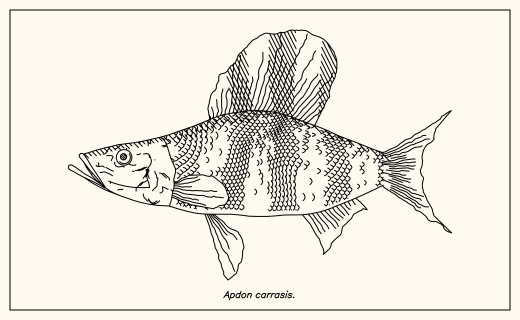
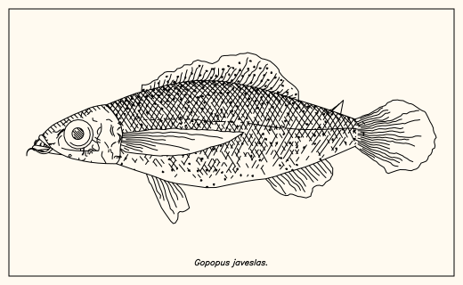
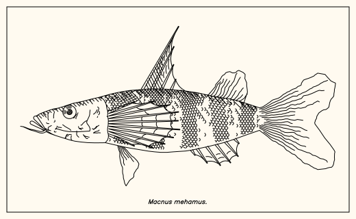
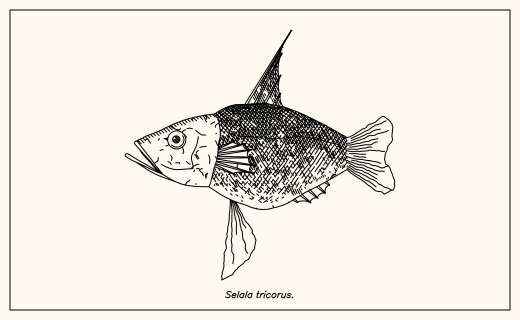
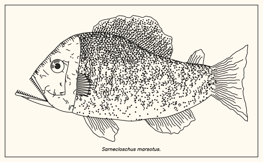
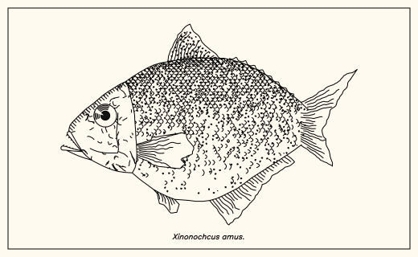

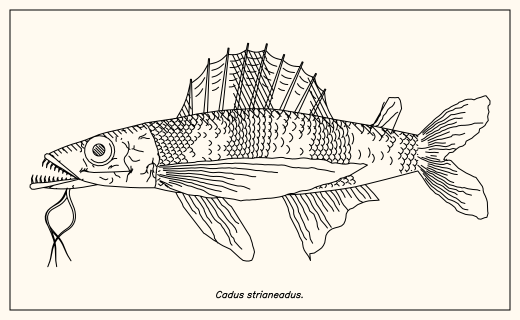
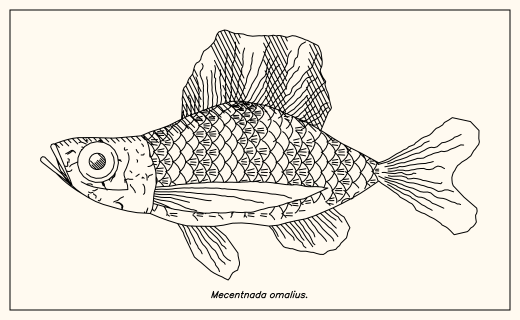
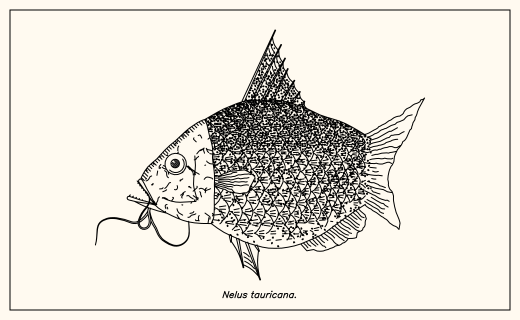
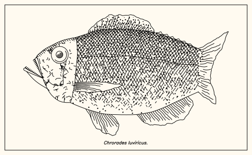
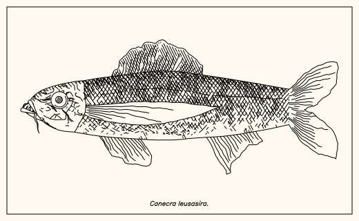
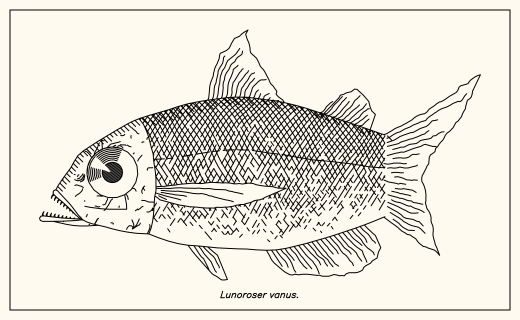
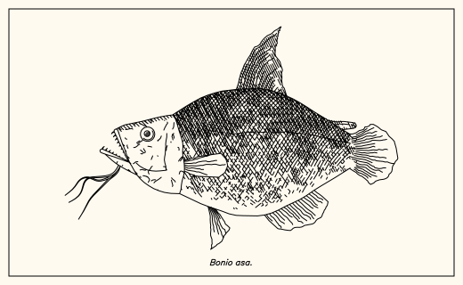
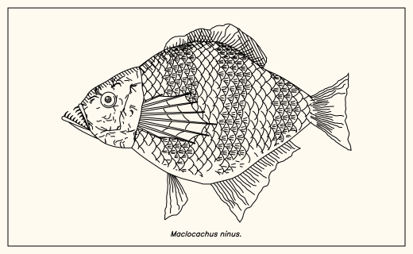
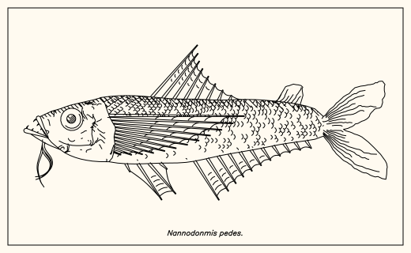
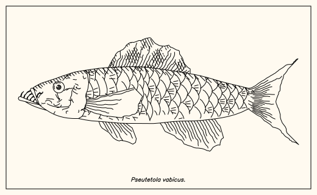
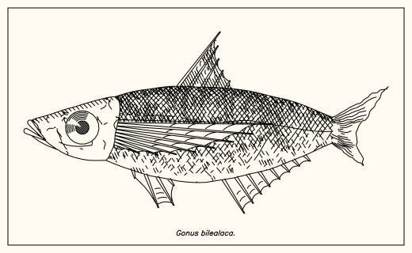
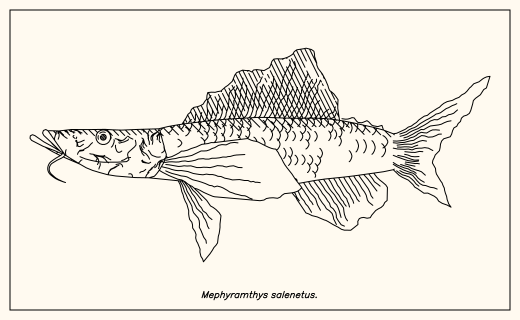
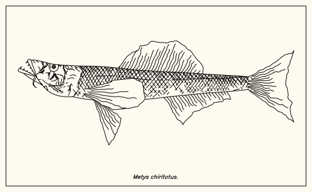
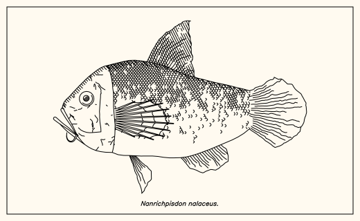
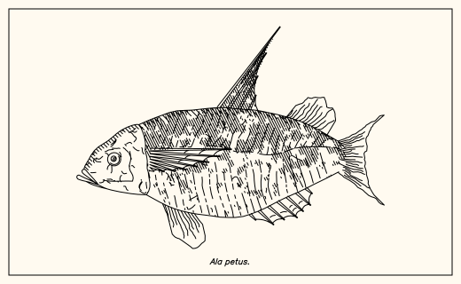
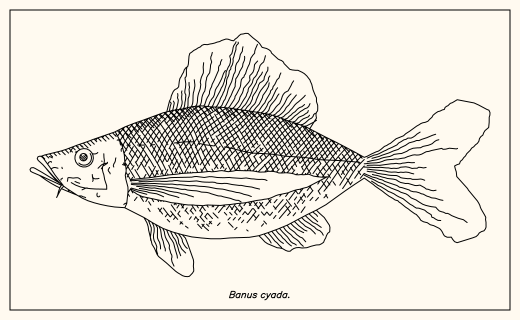
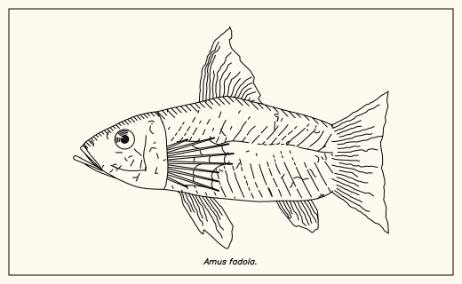
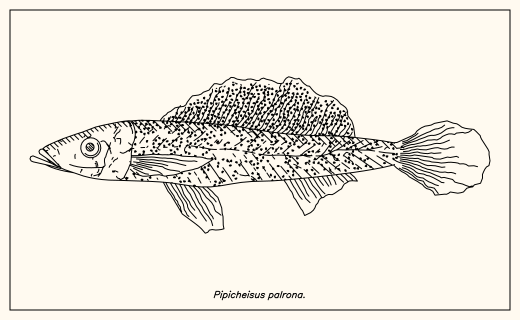
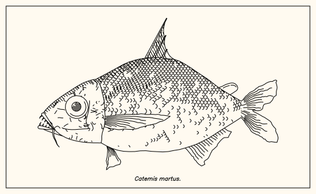
